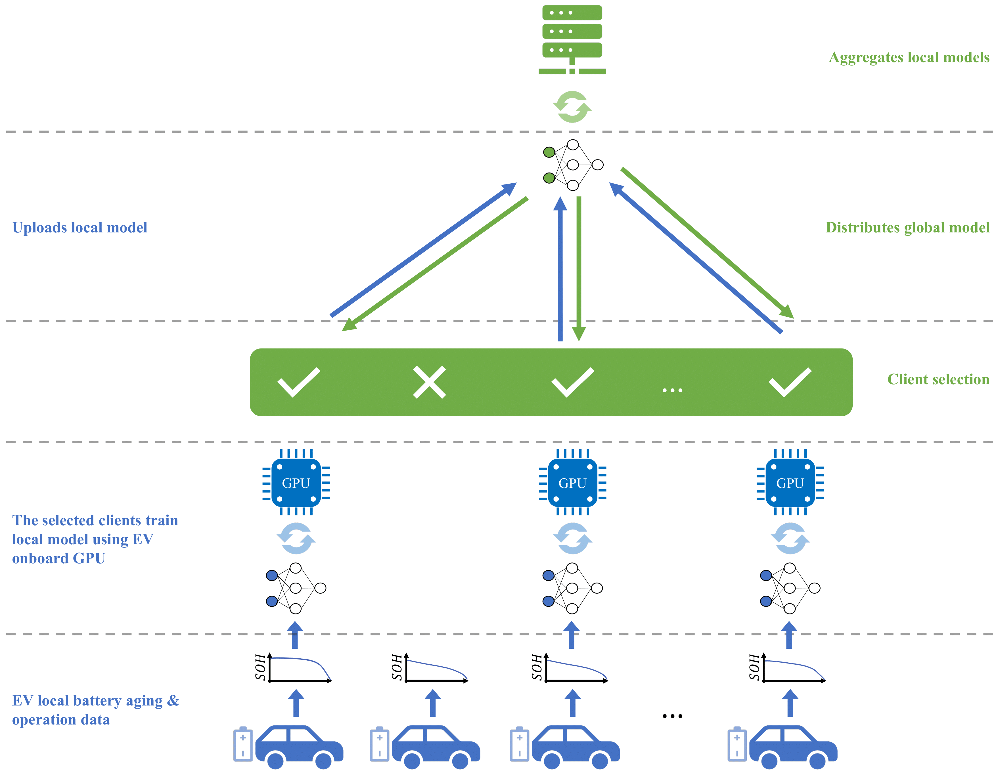

# Decentralized Battery Health Forecasting with Federated Learning

This repository contains the code for the paper [Decentralized Deep Learning Approach for Lithium-Ion Batteries State of Health Forecasting Using Federated Learning](https://ieeexplore.ieee.org/document/10400512/) by Kei Long Wong, Rita Tse, Su-Kit Tang, and Giovanni Pau.

<!--  -->
<p align="center">
  
</p>

We propose the utilization of federated learning to train a lithium-ion battery health forecasting model in a decentralized manner.
All the experiments carried out in this study have been specifically customized to align with real-world conditions.
A client selection strategy designed specifically for battery health forecasting is presented, which is demonstrated to increase accuracy throughout the training process.
The evaluation results show that the predictive model trained in a decentralized manner exhibits comparable overall performance to the centralized counterpart.
The experiment is performed on the public battery aging dataset: [MIT-Stanford](https://data.matr.io/1/projects/5c48dd2bc625d700019f3204).

## Source Code Explanation

- [arg_parser.py](arg_parser.py): the codes used to parse command line arguments.
- [client_dataset.py](client_dataset.py): the pytorch dataset class that is used in client training. It restricts each client to access only its own data.
- [client_trainer.py](client_trainer.py): the implementation of the client completing one global training round.
- [constants.py](constants.py): the constant parameters of the experiments.
- [masked_mae.py](masked_mae.py): the implementation of masked MAE loss that ignores the padded values in the result array.
- [masked_mape_loss.py](masked_mape_loss.py): the implementation of masked MAPE loss that ignores the padded values in the result array.
- [masked_rmse_loss.py](masked_rmse_loss.py): the implementation of masked RMSE loss that ignores the padded values in the result array.
- [mit_stanford_data_preprocessing.ipynb](mit_stanford_data_preprocessing.ipynb): a jupyter notebook that is used for the preprocessing of the [MIT-Stanford](https://data.matr.io/1/projects/5c48dd2bc625d700019f3204) dataset. It contains the codes of data cleaning and feature extraction.
- [mit_stanford_features_dataset.py](mit_stanford_features_dataset.py): the pytorch dataset class that is used in the training. It loads the preprocessed data and generate padded sequence data for timeseries prediction.
- [server_trainer.py](server_trainer.py): The codes used to handle the procedure of the training in the server side.
- [train_fl_lstm.py](train_fl_lstm.py): The main code of the experiment.
- [data/](data/): it contains the data of the [MIT-Stanford](https://data.matr.io/1/projects/5c48dd2bc625d700019f3204) dataset that is preprocessed by [mit_stanford_data_preprocessing.ipynb](mit_stanford_data_preprocessing.ipynb).
- [results/](results/): the training result will be output to this directory.

## Quick start

### Install requirements

Python packages
```
pytorch
torchinfo
tqdm
```

Alternatively, you can create conda environment from our yml file. Depending on your server's configuration, the version of PyTorch may differ.
```
conda env create -f environment.yml
```

### Available arguments

Use below command to view the available arguments.

```
python train_fl_lstm.py -h
```

### Training

Start training with the desired parameters. Example command is shown below:

```
python train_fl_lstm.py --global_rounds 100 --use_preprocess_curve_ratios --lstm_layers 4 --lstm_bidirectional --client_select_method curve_ratio --client_select_sort_reverse --exp_name exp1
```

## Citation

If you find this work helpful, please consider to star this repository and cite our paper:

*Decentralized Deep Learning Approach for Lithium-Ion Batteries State of Health Forecasting Using Federated Learning* [DOI: [TTE.2024.3354551](https://doi.org/10.1109/TTE.2024.3354551)]

```
@ARTICLE{10400512,
  author={Wong, Kei Long and Tse, Rita and Tang, Su-Kit and Pau, Giovanni},
  journal={IEEE Transactions on Transportation Electrification}, 
  title={Decentralized Deep Learning Approach for Lithium-Ion Batteries State of Health Forecasting Using Federated Learning}, 
  year={2024},
  volume={},
  number={},
  pages={1-1},
  doi={10.1109/TTE.2024.3354551}}
```
